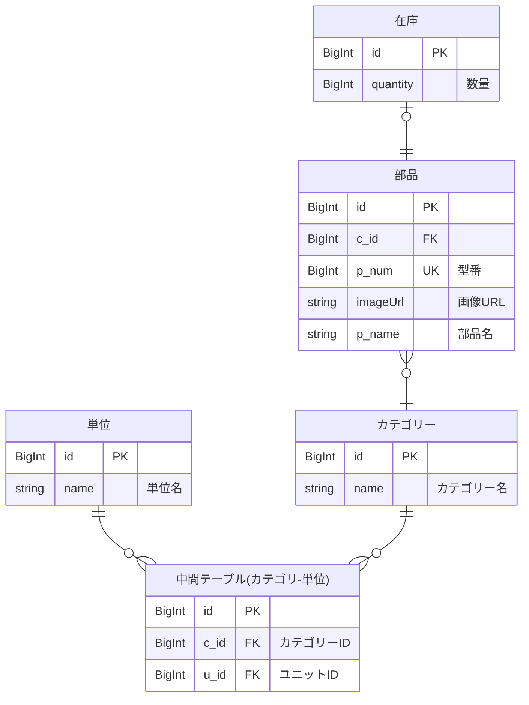

# ER図

```mermaid
erDiagram
    Units ||--o{ Category_Units:""
    Category ||--o{ Category_Units:""
    Parts }o--|| Category:""
    Inventory |o--|| Parts:""

    Units[単位] {
        BigInt id PK
        string name "単位名"
    }

    Category[カテゴリー] {
        BigInt id PK
        string name "カテゴリー名"
    }

    Category_Units["中間テーブル(カテゴリ-単位)"] {
        BigInt id PK
        BigInt c_id FK "カテゴリーID"
        BigInt u_id FK "ユニットID"
    }

    Parts[部品] {
        BigInt id PK
        BigInt c_id FK
        BigInt p_num UK "型番"
        string imageUrl "画像URL"
        string p_name "部品名"
    }

    Inventory[在庫] {
        BigInt id PK
        BigInt quantity "数量"
    }
```
